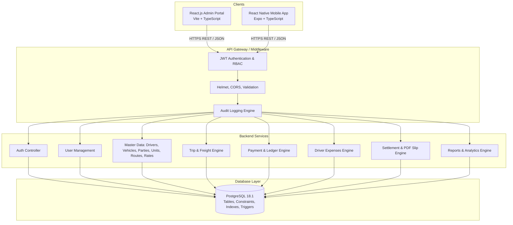

# KSP Transport Management System — Architecture Document

## System Overview

The KSP Transport Management System is designed around a secure, decoupling-first client-server architecture. All persistent data is managed by a central PostgreSQL database. Neither the React Admin Panel nor the React Native Mobile App ever connects directly to PostgreSQL; all communication is strictly brokered through authenticated REST APIs.

---

## Architectural Diagram

---

## Security Architecture

1. **Authentication:**
   - Flow: Username + Password verified against bcrypt salted hashes (12 rounds).
   - Generates signed HMAC-SHA256 JWT tokens containing `userId`, `username`, and `role`.
   - Strictly NO plain-text storage and NO SMS OTP dependencies.
2. **Authorization (RBAC):**
   - `ADMIN`: Unrestricted access to master management, system users, global financial summaries, compliance logs.
   - `TRANSPORT_USER`: Mobile operator access scoped to dispatched trips, party payment collections, driver expense claims, and trip settlement slips.
3. **Financial Integrity:**
   - All critical calculations (Total Freight, Balance Due, Expense Sum, Driver Balance) are enforced and calculated in backend PostgreSQL transactions using `FOR UPDATE` row-level locks. Frontend display math is non-authoritative.
