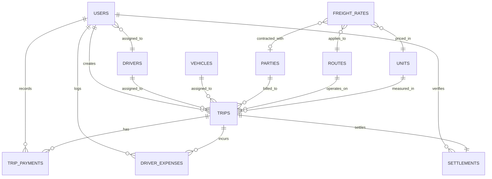

# KSP Transport Management System — Database Schema & Data Dictionary

## PostgreSQL Entity-Relationship Model

---

## Entity Descriptions

### 1. `users`
| Column | Type | Constraints | Description |
|---|---|---|---|
| `id` | SERIAL | PRIMARY KEY | Unique user ID |
| `username` | VARCHAR(50) | UNIQUE, NOT NULL | Login username |
| `name` | VARCHAR(100) | NOT NULL | User's full name |
| `password_hash` | VARCHAR(255) | NOT NULL | Bcrypt hash |
| `email` | VARCHAR(100) | NULL | User email |
| `mobile_number` | VARCHAR(20) | NULL | Mobile contact |
| `role` | VARCHAR(20) | CHECK ('ADMIN', 'TRANSPORT_USER') | System role |
| `driver_id` | INTEGER | REFERENCES drivers(id) | Associated driver ID |
| `status` | VARCHAR(10) | CHECK ('ACTIVE', 'INACTIVE') | Account state |
| `last_login` | TIMESTAMP | NULL | Last login time |

### 2. `trips`
| Column | Type | Constraints | Description |
|---|---|---|---|
| `id` | SERIAL | PRIMARY KEY | Unique trip number |
| `trip_date` | DATE | NOT NULL | Dispatch date |
| `vehicle_id` | INTEGER | REFERENCES vehicles(id) | Assigned lorry |
| `driver_id` | INTEGER | REFERENCES drivers(id) | Assigned driver |
| `party_id` | INTEGER | REFERENCES parties(id) | Client party |
| `route_id` | INTEGER | REFERENCES routes(id) | Origin-Destination |
| `unit_id` | INTEGER | REFERENCES units(id) | Unit (e.g. Tons) |
| `freight_rate` | DECIMAL(12,2) | CHECK (>= 0) | Rate per unit |
| `goods_weight` | DECIMAL(12,3) | CHECK (> 0) | Loaded weight |
| `total_freight` | DECIMAL(14,2) | goods_weight × freight_rate | Total billed |
| `advance_paid` | DECIMAL(12,2) | DEFAULT 0 | Trip advance |
| `status` | VARCHAR(20) | CHECK ('NEW', 'PAYMENT_PENDING', 'PARTIALLY_PAID', 'SETTLED', 'CANCELLED') | Trip state |

### 3. `trip_payments`
| Column | Type | Constraints | Description |
|---|---|---|---|
| `id` | SERIAL | PRIMARY KEY | Payment voucher ID |
| `trip_id` | INTEGER | REFERENCES trips(id) | Linked trip |
| `received_amount` | DECIMAL(12,2) | CHECK (>= 0) | Amount received |
| `balance_due` | DECIMAL(12,2) | Total freight - Received | Remaining due |
| `payment_status` | VARCHAR(10) | CHECK ('PENDING', 'PARTIAL', 'RECEIVED') | Payment status |

### 4. `driver_expenses`
| Column | Type | Constraints | Description |
|---|---|---|---|
| `id` | SERIAL | PRIMARY KEY | Expense entry ID |
| `trip_id` | INTEGER | REFERENCES trips(id) | Linked trip |
| `expense_type` | VARCHAR(20) | CHECK ('FREIGHT_BASED', 'LOADING', 'UNLOADING', 'TOLL', 'FOOD', 'REPAIR', 'OTHER') | Category |
| `amount` | DECIMAL(12,2) | CHECK (>= 0) | Incurred expense |

### 5. `settlements`
| Column | Type | Constraints | Description |
|---|---|---|---|
| `id` | SERIAL | PRIMARY KEY | Settlement slip ID |
| `trip_id` | INTEGER | UNIQUE, REFERENCES trips(id) | Linked trip |
| `total_freight` | DECIMAL(14,2) | Total trip freight | Billed freight |
| `total_expenses` | DECIMAL(12,2) | Sum of trip expenses | All expenses |
| `advance_paid` | DECIMAL(12,2) | Advance given | Advance deduction |
| `balance_to_driver`| DECIMAL(12,2) | total_expenses - advance_paid | Net driver balance |
| `settlement_status`| VARCHAR(10) | CHECK ('PENDING', 'VERIFIED') | Slip status |

### 6. `audit_logs`
| Column | Type | Description |
|---|---|---|
| `id` | SERIAL | Unique log ID |
| `user_id` | INTEGER | Acting user |
| `action` | VARCHAR(100) | Operational event |
| `module` | VARCHAR(50) | Affected domain |
| `record_id` | VARCHAR(50) | Target entity ID |
| `details` | JSONB | Changes and payload snapshot |
| `created_at` | TIMESTAMP | Event timestamp |
